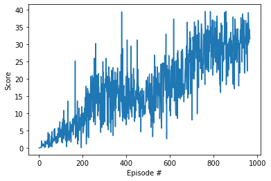

# Report

## Learning algorithm
For the project, the learning algorithm used to train the agent is based on the work of Shangtong Zhang (https://github.com/ShangtongZhang/DeepRL.)
The approach Shangtong Zhang took in developing agents makes them agnostic to the specific environment they might be used for. 

Due to the continuous nature of the action-space, the specific algorithm used was DDPG. Our own implementation of the DDPG agent can be found in the notebook Continuous_Control.ipynb .

From Shangtong Zhang's code, we this agent leveraged:
- DeterministicActorCriticNet: A convenient wrapper over the actor and critic networks required for DDPG.
- UniformReplay: Replay buffer implementation.
- OrnsteinUhlenbeckProcess: Implementation of the Ornstein-Uhlenbeck process, a solution for exploration in continuous action space.

The following configurations/hyper-parameters were used:
- Reward discounting factor: 0.99
- Soft update parameter: 5e-3
- Ornstein-Uhlenbeck process: standard deviation of 0.2
- Actor network: Fully connected network with layers [100, 50, 20] and relu gates (and tanh activation to predict the action.)
- Critic network: Fully connected network with layers [100, 50, 20] and relu gates (linear activation)
- Optimizer (for both nerworks): Adam with learning rate 1e-3 
- Replay buffer: memory size of 1e6 and batch size of 100.
- Updates frequency: every 4 time steps.
- Warm up: Wait 1e3 time steps before starting updates.

   
## Solving the environment
The average reward between episodes 867 and 967 is 30.01 . We can then say that the environment
was solved after episode 867.

## Plot of rewards

## Ideas for future work

1. There are definitely opportunities of improving the agent through hyper-parameters tuning (including the architecture of the actor/critic networks in the DDPG agent.)
2. Parallelization: Leveraging the second version of the Reacher environment with the 20 identical agents, algorithms like PPO and D4PG would very likely reduce the time (clock-time) of training before solving the environment.